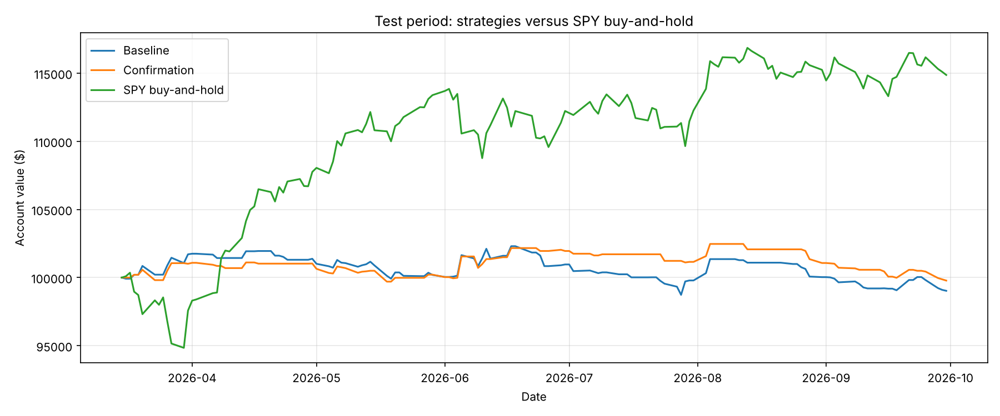
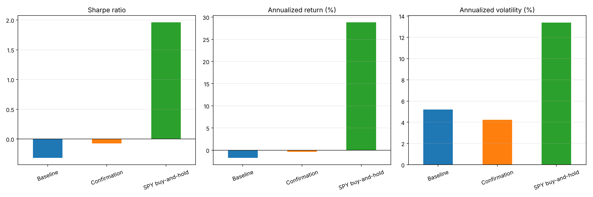

# SPY intraday momentum case study

A Python notebook implementing a fixed-size core subset of Zarattini, Aziz and Barbon (2025), and an original two-signal confirmation variation.

## Main finding

Neither intraday strategy was profitable after costs in the final test period. Confirmation lost less than the baseline in testing but more in development, and the daily difference between the two rules is not statistically distinguishable from zero (paired t-statistics about -0.3 and +0.3). Its lower volatility is largely mechanical, because it trades about 35-40% less. Buy-and-hold outperformed both during testing (about +15% over the test period, versus -1.0% and -0.2%). The baseline matches the paper's "current band + VWAP" stop with 100% sizing (Table 2, second row), not its dynamically leveraged headline result, so this is not a reproduction of the 1.33-Sharpe figure.

## Files

- `spy_intraday_backtest.ipynb`: data access, validation, indicators, split, trade engine, variation, evaluation, cost sensitivity and trade checks.
- `requirements.txt`: Python dependencies.
- `results/final_results.csv`: authoritative full-calendar metrics from the submitted run.
- `results/*.png`: saved figures extracted from the submitted notebook outputs.
- `.gitignore`: excludes vendor raw data and common private/local files.

The notebook regenerates detailed trade logs, daily account series, cost-sensitivity and exit-price-sensitivity CSVs when run. Those additional files are not supplied separately in this package. The final notebook was executed end to end on the original raw data and reproduced every headline number in the table below and every trade list. The trade lists were also matched to an independently written implementation of the same rules (identical for all four runs).

## Run

1. Open the notebook in Google Colab, or run Jupyter from the repository root.
2. Install dependencies if needed: `pip install -r requirements.txt` (in Colab, use `!pip install requests pandas numpy matplotlib`).
3. Run cells in order. If the three raw CSVs already exist in `data/`, the downloader reuses them. Otherwise it asks privately for a Massive API key and downloads data. Basic historical permissions and request limits must permit the specified dates.
4. Review printed exclusions, checks and final tables. Results are saved under `results/`.

No API key is included. Do not publish keys or raw vendor data without redistribution permission. The fixed dates can eventually fall outside a rolling free history window; reproducing then requires suitable account access or a privately retained copy of the original data.

## Data and evaluation

Massive unadjusted SPY one-minute OHLCV, daily prices and cash dividends: 2024-11-01 through 2026-09-30. The recorded download contains 185,525 minute rows, 478 daily rows and eight dividends. Five sessions are excluded, all of them scheduled early closes (29 Nov 2024, 24 Dec 2024, 3 Jul 2025, 28 Nov 2025, 24 Dec 2025; none in the test period); 473 complete sessions remain and the first 14 are warm-up.

Split 459 eligible sessions chronologically into 321 development and 138 test sessions:

- Development: 2024-11-21 through 2026-03-13.
- Test: 2026-03-16 through 2026-09-30.

Final daily evaluation includes excluded sessions as zero-return cash days. Both test accounts start at $100,000 independently of development. Rolling indicators update only using earlier observations; no strategy tuning is performed on test outcomes.

## Trading rules

Sigma is the preceding 14 retained complete sessions' average absolute movement from the open at the same minute, not a standard deviation. Bands use max/min of today's open and dividend-adjusted previous close, multiplied by 1 ± sigma. Daily VWAP approximates trade-level VWAP with volume-weighted minute typical prices.

At completed bars at 10:00, 10:30, …, 15:30 New York time, buy above both upper band and VWAP, short below both lower band and VWAP, otherwise stay flat or exit. Execute at the next bar open. Opposite baseline signals may reverse positions. Whole shares are sized to approximately 1x account value on entry and remain fixed until exit. The 15:59 bar close proxies scheduled 16:00 liquidation; no positions remain overnight. This is an assumption: the official daily close differs from the 15:59 bar close by about $0.07 per share on average. Notebook section 14b reports an exploratory sensitivity (development baseline annualised return -0.19% becomes +1.15%; test baseline -1.77% becomes -1.48%). The headline results keep the 15:59 proxy and the sensitivity was not used to choose a convention.

The variation requires two consecutive matching half-hour signals for entry; exits remain unchanged. Confirmation resets daily and on flat/opposite signals. Its intended benefit is fewer false breakouts; its drawback is delayed entry and missed trends.

Commission: $0.0035/share/side. Ordinary slippage: $0.001/share/side; stress slippage: $0.01. Both entry and exit are charged; reversals incur both orders. Cash earns no interest. Minimum commission, borrowing fees and other charges are omitted.

## Results

| Period | Strategy | Annual return % | Annual volatility % | Sharpe | Daily maximum drawdown % |
| --- | --- | ---: | ---: | ---: | ---: |
| Development | Baseline | -0.194 | 6.491 | 0.002 | 7.741 |
| Development | Confirmation | -1.246 | 4.714 | -0.243 | 7.392 |
| Test | Baseline | -1.765 | 5.189 | -0.318 | 3.491 |
| Test | Confirmation | -0.400 | 4.241 | -0.073 | 2.624 |
| Test | SPY buy-and-hold | 28.818 | 13.372 | 1.961 | 5.497 |

Annual return uses compounded growth raised to 252/N, which scales a 6.5-month test period to a year (actual test-period returns: baseline -0.97%, confirmation -0.22%, SPY buy-and-hold +14.87%); volatility uses sample daily SD × sqrt(252); Sharpe uses arithmetic mean daily return / SD × sqrt(252), with zero risk-free rate. Drawdown uses daily closing account values and starting capital. Annualization is not a forecast. Arithmetic-mean Sharpe and compounded growth can have different signs near zero.

The benchmark buys at the first test open, sells at the final daily close, charges the same cost rates, and holds dividends as cash without reinvesting. Dividend credit on ex-date is a simplification. Its overnight exposure differs from the intraday portfolios.

At $0.01 slippage, test annualized returns worsen to -2.353% (baseline) and -0.782% (confirmation). Total costs rise from $162.32 to $486.32 for baseline and from $101.36 to $303.72 for confirmation. No rule is changed in response.

## Validation and limitations

Trade checks pass for 287/176 development trades and 132/82 test trades (baseline/confirmation). Checks cover entry signals, confirmation, fills, exits, same-day positions and accounting; they cannot detect missed trades, which is why the independent re-implementation was also compared. A look-ahead test (corrupting all data after a cutoff) left every earlier indicator value identical. These checks do not prove executable fills or validate every assumption.

Limitations: short history and single split; fixed sizing rather than dynamic volatility targeting; half-hour exits; no processing latency; approximate fills/VWAP; daily rather than intraday drawdown; assumed short availability; omitted borrowing and other fees. Notional can drift above 1x after entry. Session screening is retrospective in principle, but here all exclusions are scheduled early closes known in advance. Raw-price use requires checking splits. The notebook does not conduct formal regime tests; section 14b gives only a paired daily t-test of confirmation versus baseline. With 459 sessions the sample cannot distinguish no edge from a noisy edge of the size the paper reports. Sharpe uses a zero risk-free rate. Regulatory sale fees and interest are omitted.

Momentum may work during sustained intraday trends and fail during reversals or sideways markets. Further work: audit data/fills, use a causal missing-data policy, test longer history with walk-forward evaluation, and examine more frequent exits or volatility targeting on fresh unseen data.

## Sources and assistance

Primary source: Zarattini, Aziz and Barbon (2025), *Beat the Market: An Effective Intraday Momentum Strategy for S&P500 ETF (SPY)*.

Authors' tutorial: https://concretumgroup.com/python-backtesting-beat-the-market-an-effective-intraday-momentum-strategy-for-the-sp500-etf-spy/

Massive documentation: https://massive.com/docs/rest/quickstart

Strategy/indicator ideas derive from the paper and tutorial. ChatGPT assisted with implementation and documentation. The applicant should understand and take responsibility for the submitted work.
